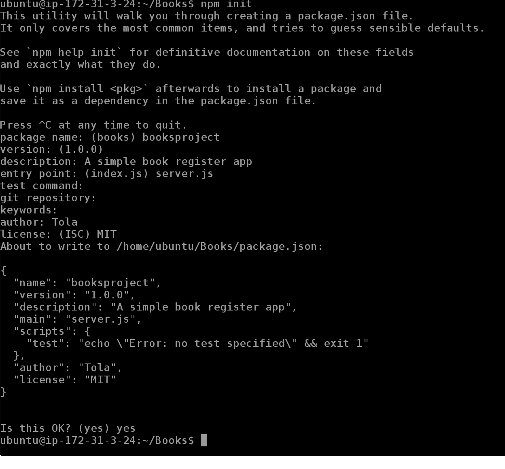
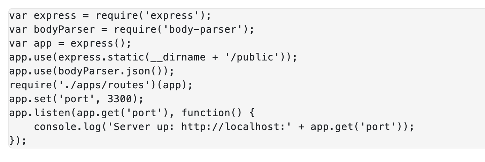
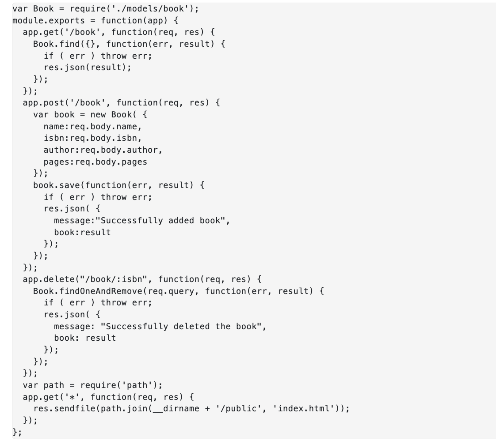
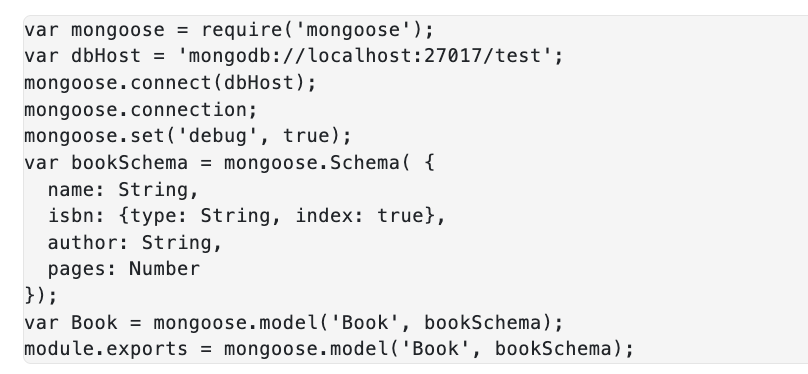
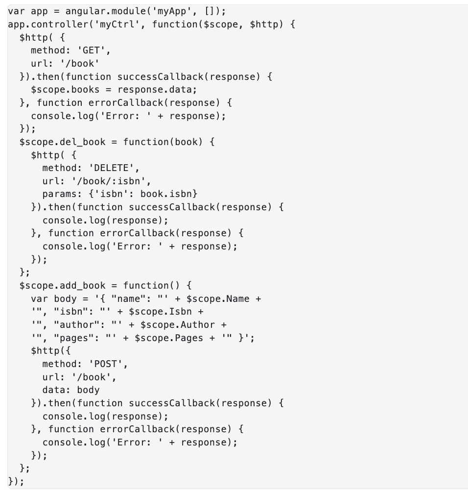
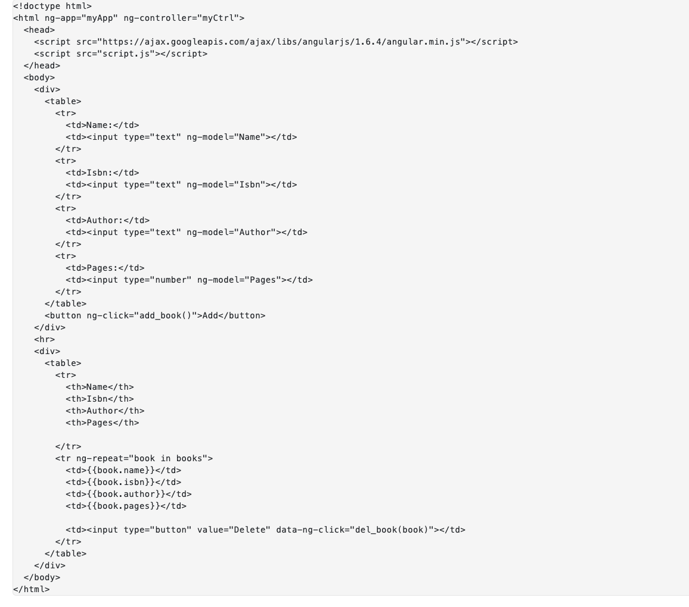
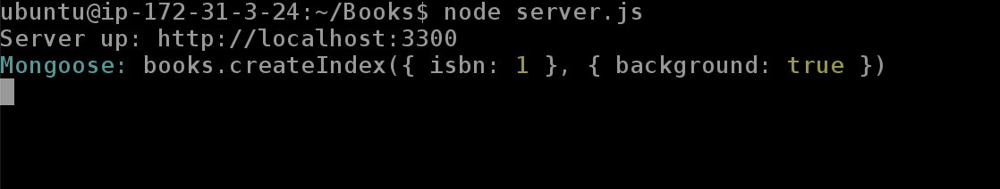
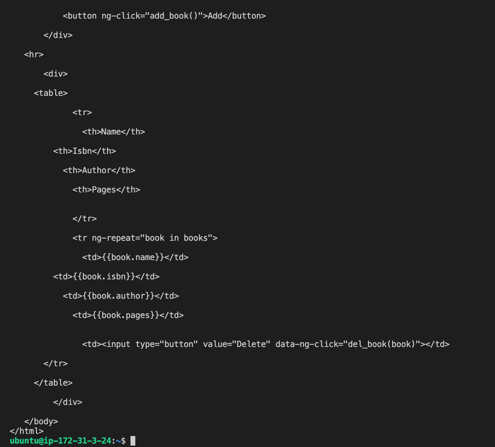
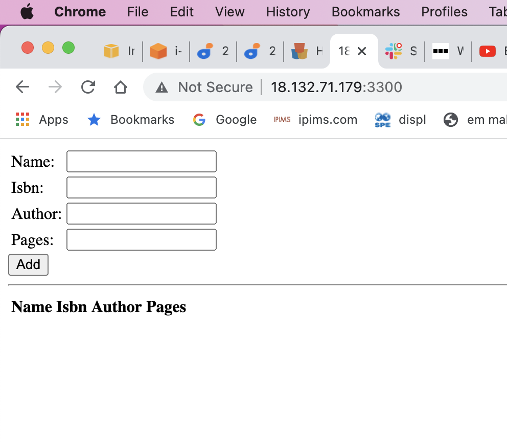
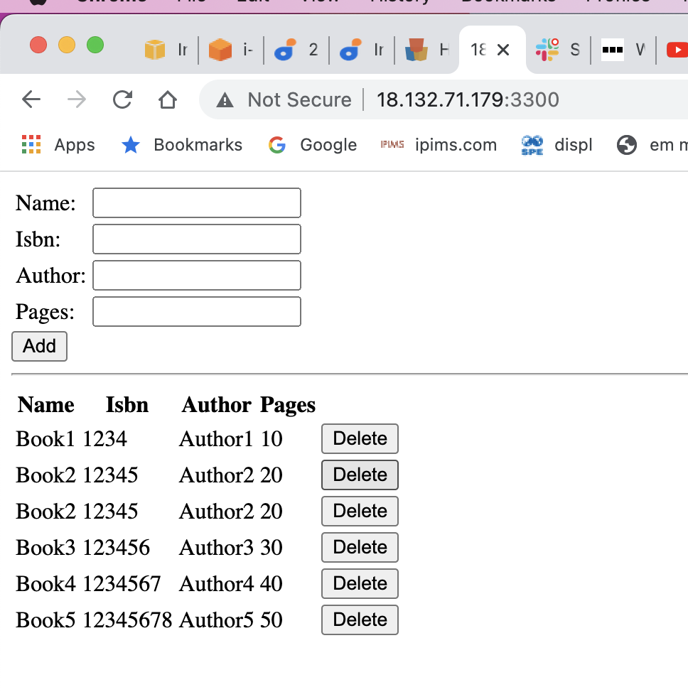

### MEAN STACK DEPLOYMENT TO UBUNTU IN AWS

#### Step 1: Install NodeJs
This is done using the code below in the following order 

Update Ubuntu

`sudo apt update`

Upgrade Ubuntu

`sudo apt upgrade`

Add certificates

`sudo apt -y install curl dirmngr apt-transport-https lsb-release ca-certificates`

`curl -sL https://deb.nodesource.com/setup_12.x | sudo -E bash -`

Install NodeJS

`sudo apt install -y nodejs`

#### Step 2: Install MongoDB

Run the following code:

`sudo apt-key adv --keyserver hkp://keyserver.ubuntu.com:80 --recv 0C49F3730359A14518585931BC711F9BA15703C6`

The code below is used to add a repository for mongoDB

`echo "deb [ arch=amd64 ] https://repo.mongodb.org/apt/ubuntu trusty/mongodb-org/3.4 multiverse" | sudo tee /etc/apt/sources.list.d/mongodb-org-3.4.list`

Install mongoDB

`sudo apt install -y mongodb`

Start the Server

`sudo service mongodb start`

Verify service is up and running

`sudo systemctl status mongodb`

Install npm – Node package manager.

`sudo apt install -y npm`

We need ‘body-parser’ package to help us process JSON files passed in requests to the server. Install it using below:

`sudo npm install body-parser`

Create folder named "Books"
`mkdir Books && cd Books`

In the Books directory, Initialize npm project

`npm init`

Add a file to it named `server.js`

Below is a snapshot of the entries I have included after running the `npm init` command 

`vi server.js`

Copy and paste the web server code below into the server.js file.

#### Step 3: Install Express and set up routes to the server

Express will be used to pass the Book information to and from our database. Express is a node.js web application framework that provides features for web and mobile applications. 

We will also be using Mongoose package which will be used to establish a schema for the database data of our book register

`sudo npm install express mongoose`

A folder called Apps is created in the Books directory per below:

`mkdir apps && cd apps`

Create a file called `routes.js` and then paste the contents below into it:

In the recently created apps folder, create a folder called `models`

Create a file called `books.js` and paste the following into the file:

#### Step 4 – Access the routes with AngularJS

AngularJS provides a web framework for creating dynamic views in your web applications. In this tutorial, we use AngularJS to connect our web page with Express and perform actions on our book register. Install Mongoose using the code below:

`sudo npm install express mongoose`

Change the directory back to books
 
`cd../..`

Create a folder called public inside books directory

`mkdir public && cd public`

Create a file called `script.js` and paste the following into it:

`vi script.js`

Create a file called `index.html` inside the `public` folder and paste teh following into it:

`vi public.html`

Change the directory back up to book folder

`cd ..`

Start the server by running the command:

`node server.js`

The server is now up and running. see snapshot below:

 We can connect it via port 3300. You can launch a separate Putty or SSH console to test what curl command returns locally.

`curl -s http://localhost:3300`

Testing above command in a separate terminal on my laptop return the html version of the app. An exercept is shown below:

Remember to add port 3300 to the inbound rules of your EC2 instance and then view the application via a web browser using the IP address of the EC2 instance. Below address is added in my browser

`http://18.132.71.179:3300`

The results in the browser is as follows:

Adding a few information into the app and the results are as follows:

